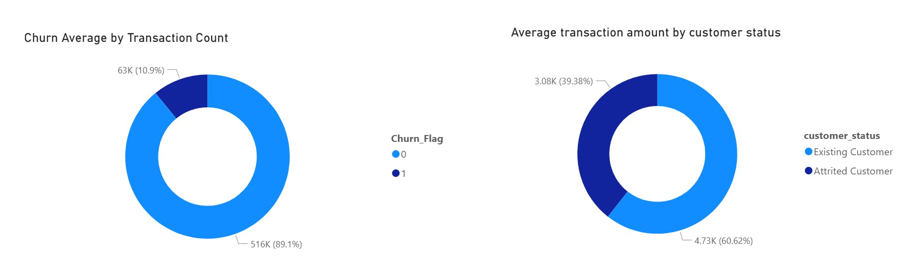
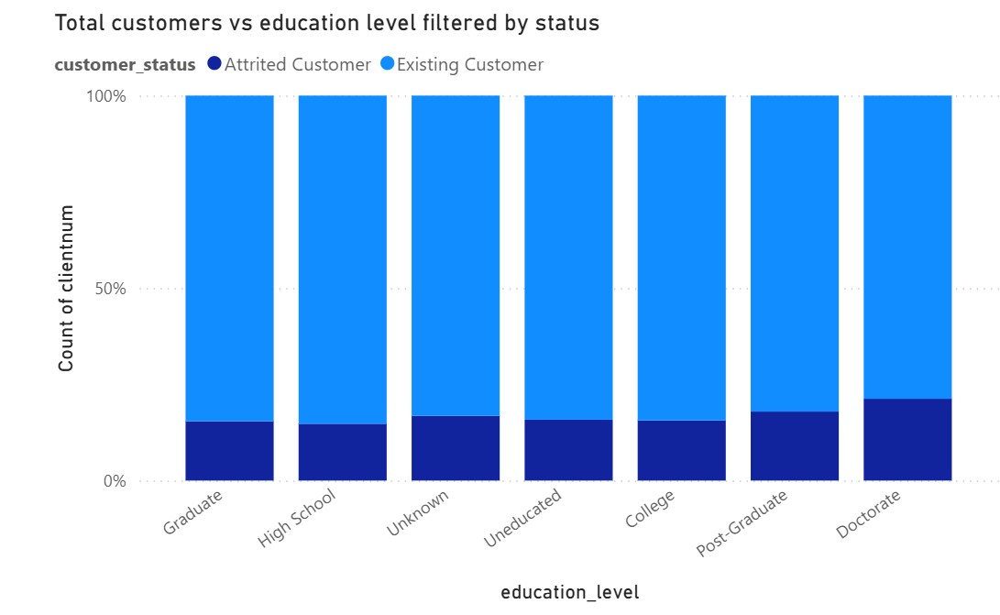
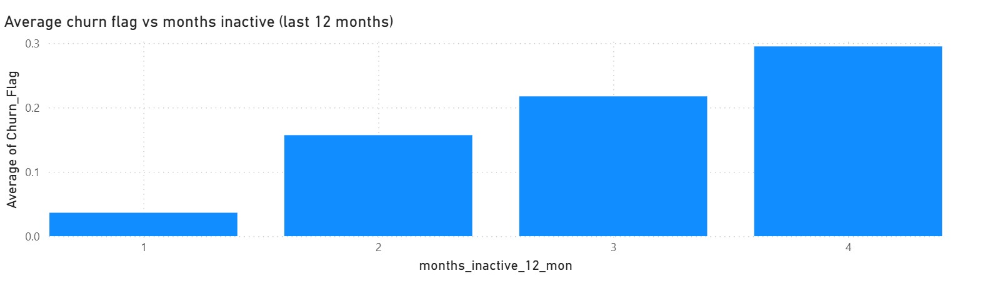
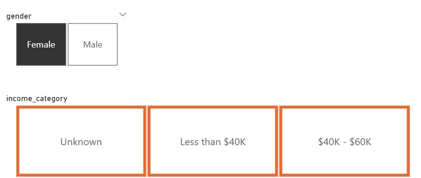
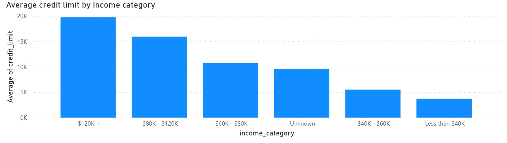

# BankChurners - Hackathon project

Project bookmarks:

-   [README](https://github.com/kumuduuk/churn-crushers/blob/main/README.md)
-   [Project board](https://github.com/users/kumuduuk/projects/3)
-   [Raw Data](https://github.com/kumuduuk/churn-crushers/blob/main/data/raw_data/BankChurners.csv) | [Clean data](https://github.com/kumuduuk/churn-crushers/blob/main/data/cleaned_data/bankchurners.csv)
-   [ETL Jupyter Notebook](https://github.com/kumuduuk/churn-crushers/blob/main/jupyter_notebooks/bankchurners.ipynb)
-   [PowerBI dashboard](https://app.powerbi.com/reportEmbed?reportId=ee6cc040-bbb3-4dcb-b472-fb5ce9e82201&autoAuth=true&ctid=c233c072-135b-431d-af59-35e05babf941)
-   [Streamlit](https://churn-crusher-dashboard.streamlit.app/)
-   [Conclusion and discussion](#conclusion-and-discussion)

## Team Members:

| Name            |      Role       |                   Responsibility                   |
| :-------------- | :-------------: | :------------------------------------------------: |
| Kumudu Liyanage | Project Manager | Oversee the project and create streamlit dashboard |
| Ali Khurshid    | Data Architect  |                 Visualise the data                 |
| Steven Naylor   |  Data Analyst   |            Clean and tranform the data             |

## Contents:

-   [Project Overview](#project-overview)
-   [Dataset Content](#dataset-content)
-   [Business Requirements](#business-requirements)
-   [Hypothesis Testing and Validation](#hypothesis-testing-and-validation)
-   [Rationale to map business requirements](#the-rationale-to-map-the-business-requirements-to-the-data-visualisations)
-   [Analysis Techniques Used](#analysis-techniques-used)
-   [Development Roadmap](#development-roadmap)
-   [Libraries & External Software Used](#libraries--external-software-used)
-   [Conclusion and discussion](#conclusion-and-discussion)
-   [Limitations](#limitations-to-the-dataset)
-   [Credits](#credits)
-   [Acknowledgements](#acknowledgements)

## Project overview

The project uses a dataset looking at existing and attrited customers from a bank. It contains over 10,000 records of customers who have used the banks services in the past or still do, using this we can identify trends and patterns within the dataset and will also look to make a predicitive model that the bank can use on future applicants to see whether they are likely to churn (leave) or not.

## Dataset content

| Field                    | Description                                                |
| ------------------------ | ---------------------------------------------------------- |
| clientnum                | Unique customer identifier                                 |
| customer_status          | 'Existing' or 'Attrited'                                   |
| age                      | Age of the customer in years                               |
| gender                   | Customer’s gender                                          |
| dependencies             | Number of dependents                                       |
| education_level          | Highest education achieved                                 |
| marital_status           | Marital status                                             |
| income_category          | Annual income sorted into brackets                         |
| card_category            | Type of credit card                                        |
| months_on_book           | Total relationship length (in months)                      |
| total_relationship_count | Total number of products                                   |
| months_inactive_12_mon   | Inactive months in the last 12 months                      |
| contacts_count_12_mon    | Number of contacts with the bank in the last 12 months     |
| credit_limit             | Credit card limit                                          |
| total_revolving_bal      | Money owed going into the next month                       |
| avg_open_to_buy          | Credit available to spend                                  |
| total_trans_amt          | Total transaction amount (12 months)                       |
| total_trans_ct           | Total transaction count (12 months)                        |
| avg_utilization_ratio    | Average card utilization                                   |
| age_bracket              | age brackets to convert age into a categorical             |
| utilization_cat          | Credit score like rating (1.00 being high risk - 0.01 low) |

## Business requirements

The bank manager is perplexed as to why an increasing number of customers are leaving their credit card services. They are looking for someone to present the historical data in a way that can help them find out if there are any patterns in who is churning and why so they can proactively approach those customers who may leave and provide them with a better service in a bid to persuade them to stay.
We will also put together a predictive model that will allow the bank to vet new applicants and deem them to be likely to churn based on our findings throughout the project.

## Hypothesis testing and validation

| Hypothesis number | Hypothesis description                                                                                                                                 | Validation method                                                                                                                              |
| ----------------- | ------------------------------------------------------------------------------------------------------------------------------------------------------ | ---------------------------------------------------------------------------------------------------------------------------------------------- |
| 1                 | Customer churn is heavily influenced by transaction activity                                                                                           | In PBI check the relationship between transaction activity and churn flag. The trnsaction can be the average amount or count                   |
| 2                 | Education level has a statistically significant association with churn rate                                                                            | Analyze whether education level has an impact on churn rate and if there are other variables that influence it indirectly.                     |
| 3                 | Inactive periods increases the likelihood of churn. Customers with more inactive months in a given period (the last 12 months) are more prone to churn | Analyze how customer inactivity impacts churn rate by plotting interactive visuals in PBI.                                                     |
| 4                 | Gender effects credit limit due to a salary gap                                                                                                        | Examine whether gender has a correlation between credit limit and what drives this.                                                            |
| 5                 | Customers on a salary < $40k are most likely to churn                                                                                                  | Examine income bracket to churn flag through PBI toolsets.                                                                                     |
| 6                 | Customers on more than 2 products are less likely to churn as it shows their satisfaction with the services the bank offers                            | Using PBI, check what the average no. of products is for churn rate to decrease.                                                               |
| 7                 | Unhappy customers are likely to contact the bank more                                                                                                  | Analyze the likelihood of contact being a measure of unhappy customers vs happy customers. Validate this by measuring the trend in churn rate. |

## The rationale to map the business requirements to the Data Visualisations

| Hypothesis                                                                                                                                             | Visualization             | Description                                                                                         | Insights Highlighted                                                                    |
| ------------------------------------------------------------------------------------------------------------------------------------------------------ | ------------------------- | --------------------------------------------------------------------------------------------------- | --------------------------------------------------------------------------------------- |
| Customer churn is heavily influenced by transaction activity                                                                                           | Donut Chart               | Shows the average churn figures by average transaction count and amount                             | Highlights the relationship between transaction activity and likelihood of churn        |
| Education level has a statistically significant association with churn rate                                                                            | 100% stacked column chart | Compares the percentage of existing customers to attrited customers across the education categories | Reveals trends or patterns of attrited customers across all the education levels.       |
| Inactive periods increases the likelihood of churn. Customers with more inactive months in a given period (the last 12 months) are more prone to churn | Stacked Column Chart      | Compares how customer inactivity impacts the averge churn likelihood                                | Reveals a rising or declining pattern vs churn.                                         |
| Gender effects credit limit due to a salary gap                                                                                                        | Stacked Bar Chart         | Plots average credit limit by gender                                                                | Shows the difference in average credit limit by gender                                  |
| Customers on a salary < 40k are most likely to churn                                                                                                   | Stacked Column Chart      | Plots average credit limit by income category                                                       | Reveals whether a trend exists between credit limit and income category                 |
| Customers on more than 2 products are less likely to churn as it shows their satisfaction with the services the bank offers                            | Line Chart                | Compares the churn rate with no. of products per customer                                           | Reveals any trends in customer satisfaction vs the number of products they subscribe to |
| Unhappy customers are likely to contact the bank more                                                                                                  | Stacked Area Chart        | Shows whether increased contact with the bank impacted churn rate or not                            | Higher churn rate with increased contact demonstrates unhappy customers and vice versa  |

## Project Board

As this was a group project all tasks within the project were assigned to users, some tasks were for the individual to complete and others allowed for a collaborative approach to be taken so were applied to multiple or all members of the group. We were assigned different roles in the group and took a lead area:  
Data Analyst - Run the data through the ETL process  
Data Architect - Visualise the data  
Project Manager/Dashboard builder - Manage the project and build the dashboard to house the project findings.

The project board allowed us to clearly plan out the three days with measurable targets to keep track of our progress.

### Day 1 — Data Understanding & Preparation

Import and Inspect the Dataset
Data Cleaning and Pre-processing
Exploratory Data Analysis (EDA)
Feature Engineering
Begin basic visualisation
Create wireframe of streamlit dashboard

### Day 2 — Analysis, Visualisation & Insights

Testing our dataset against a set of hypothesis and validation rules.
Data Visualisation (Matplotlib, Seaborn)
Descriptive Statistics & Correlation Analysis
Advanced plots to be done on Power BI
Discuss key insights, trends and patterns in the data
Build streamlit webpage and function test, ready for integrating of project components

### Day 3 - Documentation, dashboard and presentation

Integrate all necessary components of project onto streamlit webpage.
Document all steps done throughout the project on the project board
Cross reference this with the README to ensure accuracy of project notes
Proof read documents
Check over project intended outcomes, have we achieved them

## Analysis techniques used

The ETL stage of this project allowed us to deploy a number of data analysis techniques to take our raw data set and turn it into a useable clean version ready to visualise and deploy on our streamlit dashboard.

-   Data cleaning: To maintain data integrity we identified all problem values within our dataset, these include missing values, duplicates, and some incorrect data entries such as a string value being found in the age category.
-   Data categorisation: By categorising data and grouping it we were able to spot whether there were any trends or issues within our data set, one notable example being when we sorted by gender and looked at value counts of income bracket we found that women earning over $60k were not represented in this dateset. Grouping the data also allowed us to see the distribution amongst categories prior to plotting them on a histogram.
-   Outlier detection: We looked into the statistical analysis of the dataset early on, using .describe() to check the values of our numerical columns, one key area were the values between 0% and the first quartile (25%) and the third quartile (75%) and 100%. This was an early indicator of whether we had outliers in our data. Double checked with the plotting of boxplots to highlight outliers within the dataset. We then made the decision as a group which values to keep and whihc to drop.
-   Column management - To create consistency across the board we put all of our column names into lowercase letters as there was a mix of upper and lower case characters within the same column set which made writing code frustrating.

## Ethical

All data has been included anonymously, nobody in this dataset can be identified from the values in this table. The only unique identifier is the bank client number but the name of the bank has not been given anywhere.

## Bug fixes

-   No bugs to report.

## Development Roadmap

This project was the first project we have worked on as a group which also involved us using a joint github repository for the first time. This involved working to group deadlines and not to your own individual timings. It also meant there had to be compromise within the group about which features of the project to include/exclude and how to present our findings.

_"The feedback I received from my first solo project was that I needed to be more concise with my markdown and code comments, markdown to explain the why each bit of code has been included and the code comment to describe what each bit of code is doing. That is something I have made a conscious effort to include in this project. Working collaboratively lends itself to having people to bounce ideas off but can also require a bit of compromise when deciding on the best course of action as a group. Overall it's been a beneficial experience, on a steep learning curve"_ - Steven Naylor

_"Feedback from my first project refined my approach to this group work and introduced me to Power BI. I learned how to load, transform, and model data using DAX to create new columns and measures. Building an interactive, relationship-driven dashboard helped me validate our hypotheses and showcase to Kumud and Steven the value of Power BI in data architecture and advanced analysis.  "_ - Ali Khurshid

_"I learnt some extra commands for cleaning the data when it comes to preparing it so we can visualise it on graphs. I enjoyed using streamlit and would use it for future projects. I was able to help Ali and Steven use a group github repository for their first time."_ Kumudu Liyanage

As a group we performed well. We successfully completed all 'Must Have' tasks, along with a couple of 'Could Have' items. Two tasks have been set aside to be addressed in future improvements to ensure continuous progress and refinement. This approach allowed the project to meet its core objectives while laying the groundwork for ongoing development.

## Main Data Analysis Libraries

This has been a python based project, the libraries and additional software used on this project were:

-   Pandas
-   Numpy
-   Matplotlib
-   Seaborn
-   Scikit-learn
-   SciPy
-   Streamlit
-   PowerBI

## Conclusion and discussion

-   **Hypothesis 1** Transaction count emerged as the strongest factor associated with reduced churn rates. While transaction amount also shows a strong relationship, the data suggests the existence of an optimal transaction level that minimizes the likelihood of churn. This insight is explored further in the Power BI dashboard - in Streamlit.

-   **Hypothesis 2**: This assumption was disproven, as no discernible pattern was observed in the visuals comparing education level and churn. The total number of customers was plotted by education level and labeled according to their churn status, revealing no significant correlation between the two variables.

-   **Hypothesis 3** Customer inactivity over the past 12 months shows a strong correlation with churn. The more inactive a customer becomes, the higher the likelihood that they will eventually leave the bank.

-   **Hypothesis 4**: Power BI analysis revealed a clear trend indicating that male customers generally have higher credit limits compared to their female counterparts. Further investigation uncovered a corresponding income gap between genders, with the highest income bracket for female customers falling within the $40K–$60K range. This relationship is evident in the interactive Power BI dashboard. It is worth noting that an “unknown” salary category exists; however, it is reasonable to infer that these values likely fall within the two known income brackets—otherwise, the corresponding credit limits would be expected to be higher.

-   **Hypothesis 5**: Credit limit is directly influenced by income category—customers with higher incomes are offered higher credit limits by the bank. Power BI visuals clearly illustrate this trend. While this relationship is expected, it also appears to have an indirect impact on churn rate.

-   **Hypothesis 6**: Analysis indicates that customers with a higher number of product subscriptions tend to exhibit greater satisfaction. This trend is evident in the visual below, which shows a decrease in churn rate as the number of subscribed products increases. Notably, customers with two products display a slightly higher churn rate than those with only one, suggesting that single-product customers may have limited exposure for comparison and therefore perceive fewer differences in service quality.

-   **Hypothesis 7**: Analysis shows that customers who contacted the bank more frequently over the past 12 months are more likely to churn. This suggests that customers with higher contact frequency may be experiencing dissatisfaction with the bank’s services.

Having looked at the seven hypothesis outlined above we can conclude that there are some factors that act as indicators to churn. These are things such as extended account inactivity, high number of contacts with the bank but limited product engagement, and low transaction frequency. Whereas characteristics of a customer less likely to churn are that they have mulitple products with the bank, high transaction activity in terms of amount and total credit used.
Amongst the categorical columns, education status, marital status, income bracket we didn't find too many indicators that the customer is likely to churn or not more than the average 16% across all customers. Gender was to be discounted as a metric as over half of the women polled earned less than $40k and there were no females over $60k included in the dataset.

## Data Limitations based on correlation heatmap statements

From this further statistical analysis we have been able to find some limitations in this dataset:

-   High earning females (over $60k per year) are not represented in the dataset.
-   As a result gender distribution of credit limit amongst gender is skewed towards males having more.
-   Platinum card holders only amount to 20 people out of 8849. We don't have enough information to make an informed decision about the trends of platinum members that churn. Gold also only has 103 members.
-   People in their 40s make up nearly 50% of the dataset.
-   There are 6 products in the dataset but we are only given the names of four of them

## Credits

Code Institute LMS
Masterclass and data coach session notes
Code Institute project template
Kaggle - source for the dataset

## Content

All images throughout the project that were not produced by this group are free to use.

-   [Google Images](https://www.google.com/search?q=google+images&oq=google+images&gs_lcrp=EgZjaHJvbWUyDAgAEEUYORixAxiABDIHCAEQABiABDIKCAIQABixAxiABDIHCAMQABiABDIHCAQQABiABDIHCAUQABiABDIHCAYQABiABDIHCAcQABiABDIHCAgQABiABDIHCAkQABiPAtIBCDE2NjZqMWo3qAIIsAIB8QVuTNGH65UllA&sourceid=chrome&ie=UTF-8) The photo used on the home page was downloaded from Google Images, which is an open source site.

-   [Kaggle](https://www.kaggle.com/datasets/sureshgupta/health-insurance-data-set) Online library for my dataset

## Acknowledgements

-   Code institute tutors, course facilitator Emma Lamont, masterclass coach Spencer Barriball and data coach Mark Briscoe
-   Peers in September cohort for support
