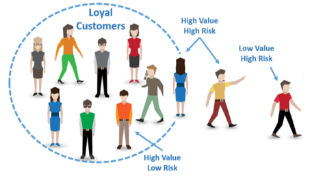
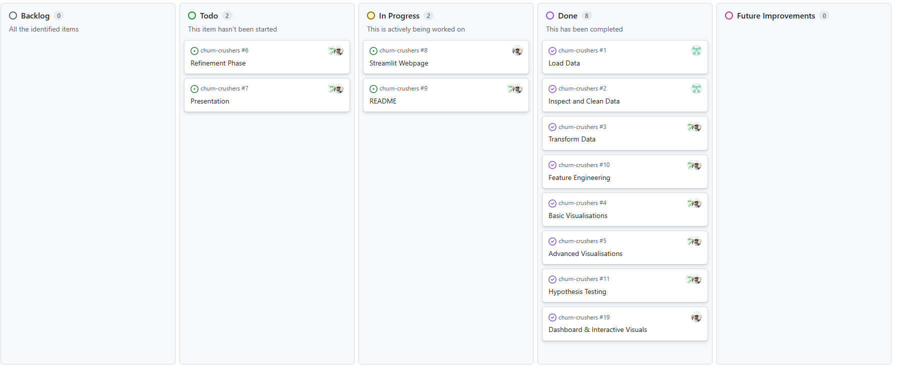

# BankChurners - Hackathon project

## Team Members:

| Name            |      Role       |                           Responsibility                            |
| :-------------- | :-------------: | :-----------------------------------------------------------------: |
| Kumudu Liyanage | Project Manager | Oversee the project, ensuring we are on track to meet project goals |
| Ali Khurshid    | Data Architecht |                         Visualise the data                          |
| Steven Naylor   |  Data Analyst   |                     Clean and tranform the data                     |

## Contents:

-   Project overview
-   Project board
-   Hypothesis testing
-   Raw Data | Clean data
-   ETL and data analysis
-   Interactive dashboard
-   Streamlit

## Project overview - Bank churners

The project uses a dataset looking at existing and attrited customers from a bank. It contains over 10,000 records of customers who have used the banks services in the past or still do, using this we can identify trends and patterns within the dataset and will also look to make a predicitive model that the bank can use on future applicants to see whether they are likely to churn (leave) or not.

## Dataset content

| Field                    | Description                                                |
| ------------------------ | ---------------------------------------------------------- |
| clientnum                | Unique customer identifier                                 |
| customer_status          | 'Existing' or 'Attrited'                                   |
| age                      | Age of the customer in years                               |
| gender                   | Customer’s gender                                          |
| dependencies             | Number of dependents                                       |
| education_level          | Highest education achieved                                 |
| marital_status           | Marital status                                             |
| income_category          | Annual income sorted into brackets                         |
| card_category            | Type of credit card                                        |
| months_on_book           | Total relationship length (in months)                      |
| total_relationship_count | Total number of products                                   |
| months_inactive_12_mon   | Inactive months in the last 12 months                      |
| contacts_count_12_mon    | Number of contacts with the bank in the last 12 months     |
| credit_limit             | Credit card limit                                          |
| total_revolving_bal      | Money owed going into the next month                       |
| avg_open_to_buy          | Credit available to spend                                  |
| total_trans_amt          | Total transaction amount (12 months)                       |
| total_trans_ct           | Total transaction count (12 months)                        |
| avg_utilization_ratio    | Average card utilization                                   |
| age_bracket              | age brackets to convert age into a categorical             |
| utilization_cat          | Credit score like rating (1.00 being high risk - 0.01 low) |

## Business requirements

The bank manager is perplexed as to why an increasing number of customers are leaving their credit card services. They are looking for someone to present the historical data in a way that can help them find out if there are any patterns in who is churning and why so they can proactively approach those customers who may leave and provide them with a better service in a bid to persuade them to stay.
We will also put together a predictive model that will allow the bank to vet new applicants and deem them to be likely to churn based on our findings throughout the project.

## Hypothesis testing - AK

## Project Board

As this was a group project all tasks within the project were assigned to users, some tasks were for the individual to complete and others allowed for a collaborative approach to be taken so were applied to multiple or all members of the group. We were assigned different roles in the group and took a lead area:
Data Analyst - Run the data through the ETL process
Data Architect - Visualise the data
Project Manager/Dashboard builder - Manage the project and build the dashboard to house the project findings.

## Analysis techniques used - AK

## Ethical

All data has been included anonymously, nobody in this dataset can be identified from the values in this table. The only unique identifier is the bank client number but the name of the bank has not been given anywhere.

## Development Roadmap - ALL

This project was the first project we have worked on as a group which also involved us using a joint github repository for the first time. This involved working to group deadlines and not to your own individual timings. It also meant there had to be compromise within the group about which features of the project to include/exclude and how to present our findings.

_"The feedback I received from my first solo project was that I needed to be more concise with my markdown and #code comments, markdown to explain the why each bit of code has been included and the #to label what each bit of code is doing. That is something I have made a conscious effort to include in this project."_ - Steven Naylor

## Main Data Analysis Libraries - SN

This has been a python based project, the libraries and additional software used on this project were:

-   Pandas
-   Numpy
-   Matplotlib
-   Seaborn
-   Streamlit
-   PowerBI

## Credits

Code Institute LMS
Masterclass and data coach session notes
Code Institute project template
Kaggle - source for the dataset

## Content

All images throughout the project that were not produced by this group are free to use.

## Acknowledgements

-   Code institute tutors, masterclass coach Spencer Barriball and data coach Mark Briscoe
-   Peers in September cohort for support

---

# Conclusion
